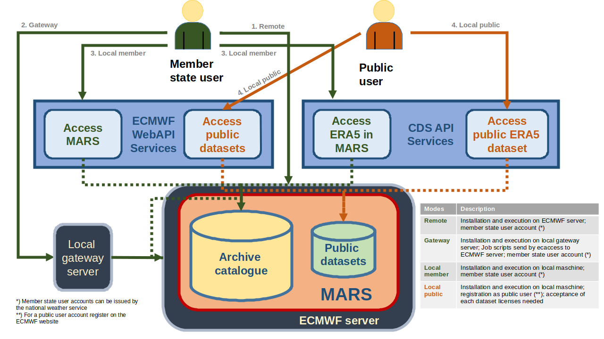

*****************
Application Modes
*****************

.. role:: underline
    :class: underline
        
.. _member state: https://www.ecmwf.int/en/about/who-we-are/member-states 
.. _instructions: https://apps.ecmwf.int/registration/

    
.. _ref-app-modes:

Arising from the two user groups described in :doc:`../../Ecmwf/access`, ``flex_extract`` has 4 different :underline:`user application modes`:

.. _ref-remote-desc:

  1. Remote (member)
      In the **Remote mode** the user works directly on ECMWF Linux member state server, such as ``ecgate`` or ``cca``. The software will be installed in the ``$HOME`` directory. The user does not need to install any of the additional third-party libraries mentioned in :ref:`ref-requirements` as ECMWF provides everything with environment modules. The module selection will be done automatically in ``flex_extract``. 
      
.. _ref-gateway-desc:
      
  2. Gateway (member)
      The **Gateway mode** can be used if a local member state gateway server is in place. Then the job scripts can be submitted to the ECMWF Linux member state server via the ECMWF web access tool ``ecaccess``. The installation script of ``flex_extract`` must be executed at the local gateway server such that the software will be installed in the ``$HOME`` directory at the ECMWF server and some extra setup is done in the local ``flex_extract`` directory at the local gateway server. For more information about establishing a gateway server please see section ???. For the **Gateway mode** the necessary environment has to be established which is described in :ref:`ref-prep-gateway`.

.. _ref-local-desc:
      
  3. Local member
      Scripts are installed and executed on a local machine, either in the current ``flex_extract`` directory or in a path given to the installation script. Under this scenario a software environment similar to that at ECMWF is required. Additionally, Web API's have to be installed to access ECMWF server. The complete installation process is described in :ref:`ref-local-mode`.
      
  4. Local public
      Scripts are installed and executed on a local machine, either in the current ``flex_extract`` directory or in a path given to the installation script. Under this scenario a software environment similar to that at ECMWF is required. Additionally, Web API's have to be installed to access ECMWF server. The complete installation process is described in :ref:`ref-local-mode`. In this case a direct registration at ECMWF is necessary and the user has to accept a specific license agreement for each dataset he/she intends to retrieve. 
      
      
An overview is sketched in figure :ref:`ref-fig-marsaccess`.

.. _ref-fig-marsaccess:

   Application modes 

    
.. toctree::
    :hidden:
    :maxdepth: 2
