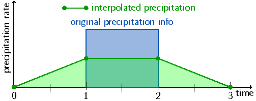
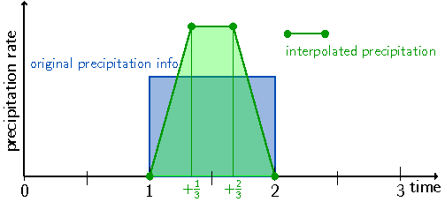
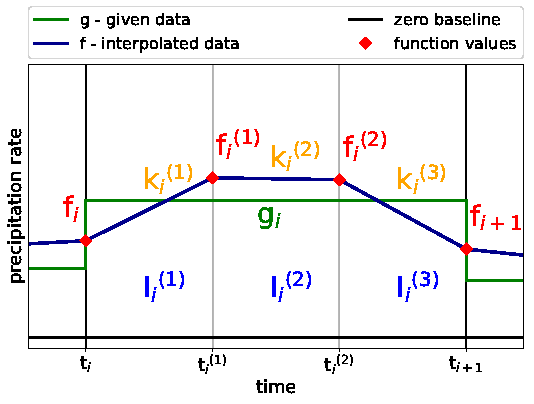

***************************
Disaggregation of Flux Data
***************************
    
``FLEXPART`` interpolates meteorological input data linearly to the position of computational particles in time and space. This method requires point values in the discrete input fields. However, flux data (as listed in table :ref:`ref-table-fluxpar`) from the ECMWF represent cell averages or integrals and are accumulated over a specific time interval, depending on the dataset. Hence, to conserve the integral quantity with ``FLEXPART``'s linear interpolation a pre-processing scheme has to be applied. 

.. _ref-table-fluxpar:

.. csv-table:: flux fields
    :header: "Short Name", "Name", "Units", "Interpolation Type"
    :align: center
    :widths: 5,15,5,10
    
    LSP,  "large-scale precipitation",          ":math:`m`",          "modified linear interpolation"
    CP,   "convective precipitation",           ":math:`m`",          "modified linear interpolation"
    SSHF, "surface sensible heat flux",         ":math:`J m^{-2}`",   "bicubic interpolation"
    EWSS, "eastward turbulent surface stress",  ":math:`N m^{-2} s`", "bicubic interpolation"
    NSSS, "northward turbulent surface stress", ":math:`N m^{-2} s`", "bicubic interpolation"
    SSR,  "surface net solar radiation",        ":math:`J m^{-2}`",   "bicubic interpolation"
    

The first step is to *de-accumulate* the fields in time so that each value represents an integral in x, y, t space.
Afterwards, a *disaggregation* scheme is applied which means to break down the integral value into point values. 
In order to be able to carry out the disaggregation procedure proposed by Paul James, additional flux data is retrieved automatically for one day at the beginning and one day at the end of the period specified. Thus, data for flux computation will be requested for the period START_DATE-1 to END_DATE+1. Note that these (additional) dates are used only for interpolation within ``flex_extract`` and are not communicated to the final ``FLEXPART`` input files.

The flux disaggregation produces files named ``fluxYYYYMMDDHH``, where ``YYYYMMDDHH`` is the date format. Note, that the first two and last two flux files do not contain any data.

.. note::

    Note also that for operational retrievals (``BASETIME`` set to 00 or 12) forecast fluxes are only available until ``BASETIME``, so that no polynomial interpolation is possible in the last two time intervals. This is the reason why setting ``BASETIME`` is not recommended for on demand scripts.        
        

Disaggregation for precipitation in older versions
--------------------------------------------------

In ``flex_extract`` up to version 5 the disaggregation was done with a Fortran program (FLXACC2). In version 6 this part was converted to Python.

In the old versions (below 7.1) a relatively simple method processes the precipitation fields in a way that is consistent with the scheme applied in ``FLEXPART`` for all variables: linear interpolation between times where input fields are available.
At first the accumulated values are divided by the number of hours (i.e., 3 or 6).
The best option for disaggregation, which was realised, is conservation within the interval under consideration plus the two adjacent ones. 
Unfortunately, this leads to undesired temporal smoothing of the precipitation time series – maxima are damped and minima are raised. 
It is even possible to produce non-zero precipitation in dry intervals bordering a precipitation period as shown in Fig. 1.
This is obviously undesirable as it will affect wet scavenging, a very efficient removal process for many atmospheric trace species. 
Wet deposition may be produced in grid cells where none should occur, or too little may be produced in others. This could lead to an unrealistic, checkerboard-like deposition fields.
Horizontally, the precipitation values are averages for a grid cell around the grid point to which they are ascribed, and ``FLEXPART`` uses bilinear interpolation to obtain precipitation rates at particle positions. 
However, the supporting points in space are not shifted between precipitation and other variables as is the case for the temporal dimension.

.. _ref-fig-olddisagg:

    Fig. 1: Example of disaggregation scheme as implemented in older versions for an isolated precipitation event lasting one time interval (thick blue line). The amount of original precipitation after de-accumulation is given by the blue-shaded area. The green circles represent the discrete grid points after disaggregation and linearly interpolate in between them as indicated by the green line and the green-shaded area. Note that supporting points for the interpolation are shifted by a half-time interval compared to the times when other meteorological fields are available (Hittmeir et al. 2018).

Disaggregation is done for 4 adjacent timespans (:math:`a_0, a_1, a_2, a_3`) which generates a new, disaggregated value which is output at the central point of the 4 adjacent timespans. 

.. math::

       p_{ac} &= 0.5 * a_1\\
            m &= a_0 + a_2 > 0.\\
    p_{ac}(m) &= a_1(m) * a_2(m) / (a_0(m) + a_2(m))\\
       p_{bd} &= 0.5 * a_2\\
            m &= a_1 + a_3 > 0.\\
    p_{bd}(m) &= a_1(m) * a_2(m) / (a_1(m) + a_3(m))\\

This new point :math:`p` is used for linear interpolation of the complete timeseries afterwards. If one of the 4 original timespans has a value below 0 it is set to 0 prior to the calculation.
    
.. math::

    p = p_{ac} + p_{bd}

Disaggregation for precipitation in version 7.1
-----------------------------------------------

Due to the problems with generating precipitation in originally dry (or lower) intervals and the temporal smoothing a new algorithm was developed. The approach is based on a one dimensional piecewise linear function with two additional supporting grid points within each grid cell, dividing the interval into three pieces. It fulfils the desired requirements by preserving the integral precipitation in each time interval, guaranteeing continuity at interval boundaries, and maintaining non-negativity. An additional monotonicity filter helps to gain monotonicity. 
The more natural requirements of symmetry, reality, computational efficiency and easy implementation motivates the linear formulation.
These requirements on the reconstruction algorithm imply that time intervals with no precipitation remain unchanged, i.e. the reconstructed values vanish throughout this whole time interval, too. 
In the simplest scenario of an isolated precipitation event, where in the time interval before and after the data values are zero, the reconstruction algorithm therefore has to vanish at the boundaries of the interval, too. 
The additional conditions of continuity and conservation of the precipitation amount then require us to introduce sub-grid points if we want to keep a linear interpolation (Fig. 2). 
The height is thereby determined by the condition of conservation of the integral of the function over the time interval.
  
    
.. _ref-fig-newdisagg:                       

    
    Fig. 2: Precipitation rate linearly interpolated using a sub-grid with two additional points. Colours as in Fig. 1 (Hittmeir et al. 2018).        
    

Figure 3 shows an overview of the new algorithm and its components.
    
.. _ref-fig-IA3:                       

   
    Fig. 3: Schematic overview of the basic notation in a precipitation interval with the original precipitation rate g (green) as a step function and the interpolated data :math:`f` (dark blue) as the piecewise linear function. The original time interval with fixed grid length :math:`\delta t` is split equidistantly in three subintervals denoted by :math:`I_i^{1,2,3}`, with the slopes in the subintervals as denoted by :math:`k_i^{1,2,3}` . The sub-grid function values :math:`f_i, f_i^{1,2}, f_{i+1}` are marked by red diamonds (Hittmeir et al. 2018).
   

The following lists the equations of the new algorithm. 
   
.. math::

    f_i^{(1)}=&\frac32 g_i -\frac{1}{12}f_{i}-\frac{5}{12}f_{i+1}
    
    f_i^{(2)}=&\frac32 g_i -\frac{5}{12}f_{i}-\frac{1}{12}f_{i+1}
    
    f_{i+1}=&\min\{3 g_i,3 g_{i+1},\sqrt{g_ig_{i+1}}\} 
    
.. math::
    
    \textbf{if}  \quad
    \mathrm{sgn}(k_{i}^{(2)})\cdot \mathrm{sgn}(k_{i  }^{(3)})&=-1 \quad \wedge \\
    \mathrm{sgn}(k_{i  }^{(3)})\cdot \mathrm{sgn}(k_{i+1}^{(1)})&=-1 \quad \wedge \\
    \mathrm{sgn}(k_{i+1}^{(1)})\cdot \mathrm{sgn}(k_{i+1}^{(2)})&=-1  \quad
    \textbf{then} 

.. math:: 
    
    f_{i+1}^\diamond=&\frac{18}{13}g_i-\frac{5}{13}f_i
    
    f_{i+1}^{\diamond\diamond}=&\frac{18}{13}g_{i+1}-\frac{5}{13}f_{i+2}
    
    f_{i+1} =& \min\left\{3 g_i,\, 3 g_{i+1},\, \sqrt{(f_{i+1}^\diamond\,f_{i+1}^{\diamond\diamond})_+}\right\}   
    
    f_i^{(1)}=& \frac32 g_i -\frac{1}{12}f_{i}-\frac{5}{12}f_{i+1}^{\textrm{mon}}
    
    f_i^{(2)}=& \frac32 g_i -\frac{5}{12}f_{i}-\frac{1}{12}f_{i+1}^{\textrm{mon}}
    
    \textbf{endif}

In the case of the new disaggregation method for precipitation, the two new sub grid points are added in the ``flux`` output files. They are identified by the forecast step parameter ``step`` which is 0 for the original time interval and 1 or 2 for the two new sub grid points respectively. The filenames do not change.   

   
.. note::

    The new method for disaggregation was published in the Geoscientific Model Development Journal in 2018:
    
    Hittmeir, S., Philipp, A., and Seibert, P.: A conservative reconstruction scheme for the interpolation of extensive quantities in the Lagrangian particle dispersion model FLEXPART, Geosci. Model Dev., 11, 2503-2523, https://doi.org/10.5194/gmd-11-2503-2018, 2018.

      
   

 

Disaggregation for the rest of the flux fields
----------------------------------------------
      
The accumulated values for the other variables are first divided by the number of hours and
then interpolated to the exact times X using a bicubic interpolation which conserves the integrals of the fluxes within each timespan.
Disaggregation is done for 4 adjacent timespans (:math:`p_a, p_b, p_c, p_d`) which generates a new, disaggregated value which is output at the central point of the 4 adjacent timespans.

.. math::
    
    p_a &= (a_3 - a_0 + 3. * (a_1 - a_2)) / 6. \\    
    p_b &= (a_2 + a_0) / 2. - a_1 - 9. * p_a / 2. \\
    p_c &= a_1 - a_0 - 7. * p_a / 2. - 2. * p_b \\    
    p_d &= a_0 - p_a / 4. - p_b / 3. - p_c / 2. 

This new point :math:`p` is used for linear interpolation of the complete timeseries afterwards.

.. math::
    
    p = 8. * p_a + 4. * p_b + 2. * p_c + p_d

        
        
.. toctree::
    :hidden:
    :maxdepth: 2
    
    
