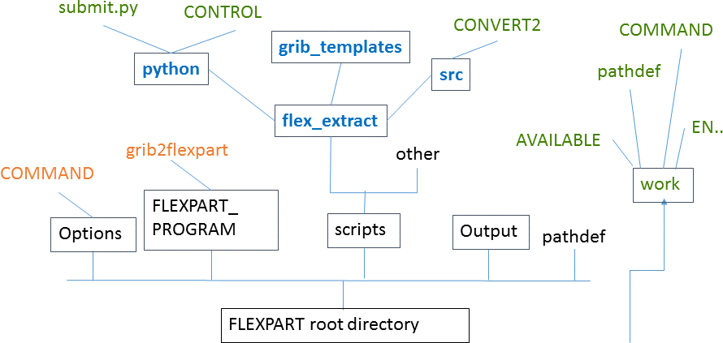

#README #

This documentation shows how to use these python scripts to extract ECMWF data and generate the ***FLEXPART*** specific input files.

### Introduction ###

To run ***FLEXPART*** with ECMWF data, you first need to retrieve ECMWF GRIB fields and generate ***FLEXPART*** specific input files afterwards. ***FLEXPART*** needs the GRIB data seperated by time so that flex_extract will combine all data in output files seperated for each time step. The format of these output filenames looks like: `prefixYYMMDDHH`, where prefix can be defined in ***flex_extract*** (usually it should be limited to "2" characters because of further processing reasons).

For setting up a complete ***FLEXPART*** environment it is recommended to build a directory structure such as:

 

For installation instructions and usage of ***FLEXPART*** please see ***FLEXPART***-Documentation!

### Overview ###

%-- list all files in python dir and shortly explain structure

##### CONTROL file #####
For specifying which ECMWF dataset you would like to retrieve and which time and spatial resolution you would like to retrieve you have to prepare a `CONTROL` file. In the directory you can find a couple of example `CONTROL` files:

```
CONTROL_CERA
CONTROL_CV
CONTROL_EA5.public
CONTROL_FC.pure
CONTROL_OD.highres.gauss
CONTROL_CERA.public
CONTROL_EA5
CONTROL_EI.global
CONTROL_FC.twiceaday
CONTROL_OPS.4V
CONTROL_CF
CONTROL_EA5.highres
CONTROL_EI.public
CONTROL_OD.highres.eta
CONTROL.temp
```

#### Python scripts ####

The main program for doing both, retrieving ECMWF data and generate the FLEXPART input files, is `submit.py`. It combines the two sub-programs `getMARSdata.py` and `prepareFLEXPART.py` which can also be run by themselves for example for debugging purposes.
To get the usage of the program, use the `-h` option:

```
usage: submit.py [-h] [--start_date START_DATE] [--end_date END_DATE]
                 [--date_chunk DATE_CHUNK] [--basetime BASETIME] [--step STEP]
                 [--levelist LEVELIST] [--area AREA] [--inputdir INPUTDIR]
                 [--outputdir OUTPUTDIR]
                 [--flexpart_root_scripts FLEXPART_ROOT_SCRIPTS] [--ppid PPID]
                 [--job_template JOB_TEMPLATE] [--queue QUEUE]
                 [--controlfile CONTROLFILE] [--debug DEBUG] [--public PUBLIC]

Retrieve FLEXPART input from ECMWF MARS archive

optional arguments:
  -h, --help            show this help message and exit
  --start_date START_DATE
                        start date YYYYMMDD (default: None)
  --end_date END_DATE   end_date YYYYMMDD (default: None)
  --date_chunk DATE_CHUNK
                        # of days to be retrieved at once (default: None)
  --basetime BASETIME   base such as 00/12 (for half day retrievals) (default:
                        None)
  --step STEP           steps such as 00/to/48 (default: None)
  --levelist LEVELIST   Vertical levels to be retrieved, e.g. 30/to/60
                        (default: None)
  --area AREA           area defined as north/west/south/east (default: None)
  --inputdir INPUTDIR   root directory for storing intermediate files
                        (default: None)
  --outputdir OUTPUTDIR
                        root directory for storing output files (default:
                        None)
  --flexpart_root_scripts FLEXPART_ROOT_SCRIPTS
                        FLEXPART root directory (to find grib2flexpart and
                        COMMAND file) Normally flex_extract resides in the
                        scripts directory of the FLEXPART distribution
                        (default: None)
  --ppid PPID           Specify parent process id for rerun of prepareFLEXPART
                        (default: None)
  --job_template JOB_TEMPLATE
                        job template file for submission to ECMWF (default:
                        job.temp)
  --queue QUEUE         queue for submission to ECMWF (e.g. ecgate or cca )
                        (default: None)
  --controlfile CONTROLFILE
                        file with control parameters (default: CONTROL.temp)
  --debug DEBUG         Debug mode - leave temporary files intact (default: 0)
  --public PUBLIC       Public mode - retrieves the public datasets (default:
                        False)
```


Optional arguments are listed in squared brackets.

The sub-programs `getMARSdata.py` and `prepareFLEXPART.py` are the two main parts of this software.

* `getMARSdata.py`

This program retrieves the ECMWF data from ECMWF servers using [ECMWF WebApi](https://software.ecmwf.int/wiki/display/WEBAPI/ECMWF+Web+API+Home) or [Mars](https://software.ecmwf.int/wiki/display/UDOC/MARS+user+documentation), depending on your user status and your selection of the running mode. It requires the `ECMWF WebApi` python library (see Requirements below). Check with your local IT group as it may be already available.


* `prepareFLEXPART.py`

This program generates FLEXPART input files. It requires python interface to grib_api and the Fortran program `CONVERT2` (located in `src` directory with instruction on how to compile it). `CONVERT2` needs a namelist which is generated from the python program.


### Requirements ###

| Python Support        | Link            | Notes |
| --------------------- |:----------------------:|:-------------------------|
| python                | [http://www.python.org](http://www.python.org)  | We have used [Anaconda python](https://store.continuum.io/cshop/anaconda/) for our testing |
| python-numpy          | [http://www.numpy.org/](http://www.numpy.org/)  | Not necessary if you have installed python Anaconda
| ecmwfapi              | [https://software.ecmwf.int/wiki/display/WEBAPI/ECMWF+Web+API+Home](https://software.ecmwf.int/wiki/display/WEBAPI/ECMWF+Web+API+Home) | You also need to install your API key (as explained in the documentation)

| Utilities             | Link            | Notes |
| --------------------- |:----------------------:|:-------------------------|
|gfortran|[https://gcc.gnu.org/wiki/GFortran](https://gcc.gnu.org/wiki/GFortran)| Make sure that you are using the same compiler version for all libraries in connection with flex_extract, GRIB_API and FLEXPART, otherwise you will have problems.|
|  grib-api             | [https://software.ecmwf.int/wiki/display/GRIB/Home](https://software.ecmwf.int/wiki/display/GRIB/Home) | Make sure you install GRIB-API with JPEG support and python GRIB-API.|
|FFTW|[http://www.fftw.org](http://www.fftw.org)|This is needed by the Emos library, as is mentioned in the installation instructions for Emos|
|  Emos                 | [https://software.ecmwf.int/wiki/display/EMOS/Emoslib](https://software.ecmwf.int/wiki/display/EMOS/Emoslib) | Make sure you carefully read the instructions and have installed the FFTW package before installing Emos.|
| CONVERT2     | |to run prepareFLEXPART.py, you need to compile the Fortragn program CONVERT2 (located in the src directory). See separate README file in this directory to get instructions on how to compile this code.|

### Installation ###

*  Environment

At UIO, Red Hat 6 Linux systems (64 bits) were used for testing. We use the [Module package](http://modules.sourceforge.net/) to set-up user environment.

* Getting the source code
In the directory of your choice:

`
git clone git@bitbucket.org:flexpart/flexpart.git
`
This command will create a subdirectory called flexpart: it contains the latest FLEXPART version.

Then set the environment variable `FLEXPART_ROOT`:

** Korn-shell or Bash users:
`
cd flexpart
export FLEXPART_ROOT=$PWD
`

** C-shell users:

`
cd flexpart
setenv FLEXPART_ROOT=$PWD
`

* Installation

Make sure you first generate the `CONVERT2` program (see separate instructions in `preproc/src`).

Users need to be able to execute prepareFLEXPART.py and getMARSdata.py so make sure they have the correct unix permissions:

`
cd preproc/python
chmod uog+rx getMARSdata.py prepareFLEXPART.py
`

These two programs must be in the user PATH. At UIO this is done automatically when loading flexpart. If not, you would need to do the following:

** Korn-shell or Bash users:
`
export PATH=$FLEXPART_HOME/preproc/python:$PATH
`

** C-shell users:

`
setenv PATH $FLEXPART_HOME/preproc/python:$PATH
`

Where `$FLEXPART_HOME` is the directory where FLEXPART 

* Testing your installation

First check that grib-api python interface is correctly installed on your platform:
`
python
>>> from gribapi import *
>>>
`
Use `CTRL-D` to quit python.

Then check that `ecmwfapi` is properly installed:
`
python
>>> from ecmwfapi import *
>>>
`

If the two previous tests were successful, you can run `tests/preproc` (See separate instructions in `tests/preproc`). 

If any of these two tests fail, this probably means that either `ecmwfapi` or `grib-api` have not been installed properly. 

Please report any problems.

###  Installation FAQ ###


